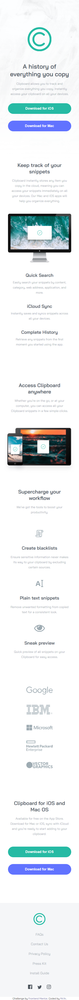
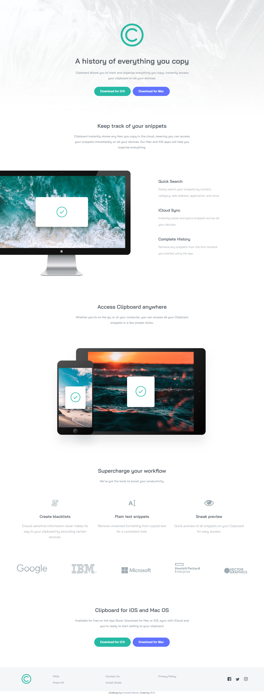

# Frontend Mentor - Clipboard landing page solution

This is a solution to the [Clipboard landing page challenge on Frontend Mentor](https://www.frontendmentor.io/challenges/clipboard-landing-page-5cc9bccd6c4c91111378ecb9). Frontend Mentor challenges help you improve your coding skills by building realistic projects. 

## Table of contents

- [Overview](#overview)
  - [The challenge](#the-challenge)
  - [Screenshot](#screenshot)
  - [Links](#links)
- [My process](#my-process)
  - [Built with](#built-with)

**Note: Delete this note and update the table of contents based on what sections you keep.**

## Overview

### The challenge

Users should be able to:

- View the optimal layout for the site depending on their device's screen size
- See hover states for all interactive elements on the page

### Screenshot

### Links

- Solution URL: [https://www.frontendmentor.io/solutions/clipboard-landing-page-using-html-and-css-9SFNSblda](https://www.frontendmentor.io/solutions/clipboard-landing-page-using-html-and-css-9SFNSblda)
- Live Site URL: [https://tempatportofolio.github.io/Clipboard-Landing-Page/](https://tempatportofolio.github.io/Clipboard-Landing-Page/)

## My process

### Built with

- CSS custom properties
- Flexbox
- CSS Grid

## Author

- Frontend Mentor - [@tempatportofolio](https://www.frontendmentor.io/profile/tempatportofolio)
- Twitter - [@mrfn99](https://www.twitter.com/mrfn99)

